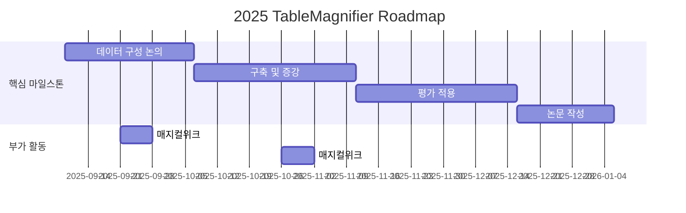

# TableMagnifier

<h1 align="center"> TableMagnifier </h1>

 

<!-- sheilds: https://shields.io/ -->
<!-- hits badge: https://hits.seeyoufarm.com/ -->

> TableMagnifier Repository에 오신 것을 환영합니다! 한국어 TableQA에 대한 신뢰도 높은 데이터를 구축하고 평가하는 것을 목표로 합니다.

🚀 {{TableMagnifier}} — 가짜연구소 11기 NLx Crew 소속 프로젝트

“함께 만드는 우연한 혁명(Serendipity Revolution)”
진실함과 신뢰를 바탕으로 AI/DS 혁신 커뮤니티와 기술 실험을 진행합니다.

## 🌟 프로젝트 목표 (Project Vision)
_"이론에서 실전까지, 함께 성장하는 AI 실험실"_  
- 개인 성장과 집단 지혜의 시너지 창출
- 오픈소스 정신을 바탕으로 한 지식 공유 문화
- 실패를 성공의 디딤돌로 만드는 실험적 접근
- 논문 리뷰 프로젝트 — 최신 AI 논문 분석, 토론, 실험 재현
- 오픈소스 프로젝트 — AI·데이터 처리 관련 라이브러리 개발 및 개선
- 컨퍼런스 논문 투고 — 최신 연구 수행 및 국제 학회 제출 준비

## 🧑 팀 소개 (Dynamic Team)

| 역할          | 이름 |  기술 스택 배지                                                                 | 주요 관심 분야                          |
|---------------|------|-----------------------------------------------------------------------|----------------------------------------|
| **Project Manager** | 박세연 |   | VLM, Image Captioning, SLT           |
| **Member** | 최재혁 |   | LLM, RAG, Agent                  |
| **Member** | 이명진 |   | LLM, SLT                  |
| **Member** | 김진아 |   | NLP, Data Science                  |
| **Member** | 서석현 |   | VLM, Data Statistics               |
| **Member** | 임예원 |   | Compiler, Ontology                 |

## 🚀 프로젝트 로드맵 (Project Roadmap)

## 💻 주차별 활동 (Activity History)

| 주차 | 날짜 | 활동 | 결과물 유형 | 비고 |
| --- | --- | --- | --- | --- |
| 1 | 9/9 | Introduction |  | 온라인 |
| 2 | 9/16 | 논문 리뷰 (배정 1권, 개별 1권) | 논문 리뷰 문서 | 온라인 |
|  | 9/23 | Magical Week |  | 오프라인 |
| 3 | 9/30 | 논문 리뷰 (배정 1권, 개별 1권) | 논문 리뷰 문서 | 온라인 |
| 4 | 10/14 | Dataset 구성 논의 |  | 온라인 |
| 5 | 10/21 | Raw-data Collection |  | 온라인 |
|  | 10/28 | Magical Week |  | 오프라인 |
| 6 | 11/4 | Data refinement / Augmentation |  | 온라인 |
| 7 | 11/11 | Data refinement / Augmentation | 최종 데이터셋 | 온라인 |
| 8 | 11/18 | Paper Remind / Evaluation Idea Discussion |  | 오프라인 |
| 9 | 11/25 | Pipleine setting |  | 온라인 |
| 10 | 12/2 | Evaluation (Basic) | 아이디어 구현, 결과물 | 온라인 |
| 11 | 12/9 | Evaluation (Advanced) | 아이디어 구현, 결과물 | 온라인 |
| 12 | 12/16 | Evaluation (Advanced) | 아이디어 구현, 결과물 | 온라인 |
| 13 | 12/23 | Evaluation (Advanced) | 아이디어 구현, 결과물 | 온라인 |
| 14 | 12/30 | Github 관리, Paper Writing |  | 온라인 |
| 15 | 1/6 | Github 관리, Paper Writing |  | 온라인 |
| 16 | 1/13 | 회고 및 아카이빙, 투고 준비 | Paper | 오프라인 |

## 🌱 참여 안내 (How to Engage)
- 빌더로 참여 — 프로젝트 기획·운영 주도
- 러너로 참여 — 연구·개발·테스트 등 실행
- 청강 참여 — 공개 세션 참여 가능

❗️참여 링크: [가짜연구소 디스코드](https://discord.gg/EPurkHVtp2)
❗️커뮤니케이션 채널: 카카오톡

**누구나 청강을 통해 모임을 참여하실 수 있습니다.**  
1. 특별한 신청 없이 정기 모임 시간에 맞추어 디스코드 #Room-CS 채널로 입장
2. Magical Week 중 행사에 참가
3. Pseudo Lab 행사에서 만나기

## Acknowledgement 🙏

이 프로젝트는 가짜연구소 Open Academy로 진행됩니다.
여러분의 참여와 기여가 ‘우연한 혁명(Serendipity Revolution)’을 가능하게 합니다. 모두에게 깊은 감사를 전합니다.
TableMagnifier is developed as part of Pseudo-Lab's Open Research Initiative. Special thanks to our contributors and the open source community for their valuable insights and contributions.

## About Pseudo Lab 👋🏼</h2>

[Pseudo-Lab](https://pseudo-lab.com/) is a non-profit organization focused on advancing machine learning and AI technologies. Our core values of Sharing, Motivation, and Collaborative Joy drive us to create impactful open-source projects. With over 5k+ researchers, we are committed to advancing machine learning and AI technologies.

<h2>Contributors 😃</h2>

  

<h2>License 🗞</h2>

This project is licensed under the [MIT License](https://opensource.org/licenses/MIT).
