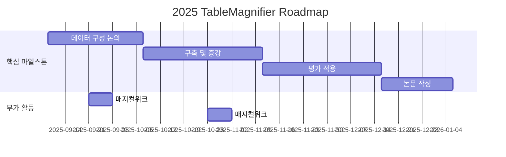

# TableMagnifier

<h1 align="center"> TableMagnifier </h1>

<div align="center">
<a href="https://pseudo-lab.com"></a>
<a href="https://discord.gg/EPurkHVtp2"></a>
<a href="https://github.com/Pseudo-Lab/10th-template/stargazers"></a>
<a href="https://github.com/Pseudo-Lab/10th-template/network/members"></a>
<a href="https://github.com/Pseudo-Lab/10th-template/pulls"></a>
<a href="https://github.com/Pseudo-Lab/10th-template/issues"></a>
<a href="https://github.com/Pseudo-Lab/10th-template/graphs/contributors"></a>
<a href="https://hits.seeyoufarm.com"></a>
</div>
<br>

<!-- sheilds: https://shields.io/ -->
<!-- hits badge: https://hits.seeyoufarm.com/ -->

> TableMagnifier Repository에 오신 것을 환영합니다! 한국어 TableQA에 대한 신뢰도 높은 데이터를 구축하고 평가하는 것을 목표로 합니다.

🚀 {{TableMagnifier}} — 가짜연구소 11기 NLx Crew 소속 프로젝트

“함께 만드는 우연한 혁명(Serendipity Revolution)”
진실함과 신뢰를 바탕으로 AI/DS 혁신 커뮤니티와 기술 실험을 진행합니다.

## 🌟 프로젝트 목표 (Project Vision)
_"이론에서 실전까지, 함께 성장하는 AI 실험실"_  
- 개인 성장과 집단 지혜의 시너지 창출
- 오픈소스 정신을 바탕으로 한 지식 공유 문화
- 실패를 성공의 디딤돌로 만드는 실험적 접근
- 논문 리뷰 프로젝트 — 최신 AI 논문 분석, 토론, 실험 재현
- 오픈소스 프로젝트 — AI·데이터 처리 관련 라이브러리 개발 및 개선
- 컨퍼런스 논문 투고 — 최신 연구 수행 및 국제 학회 제출 준비


## 🧑 팀 소개 (Dynamic Team)

| 역할          | 이름 |  기술 스택 배지                                                                 | 주요 관심 분야                          |
|---------------|------|-----------------------------------------------------------------------|----------------------------------------|
| **Project Manager** | 박세연 |   | VLM, Image Captioning, SLT           |
| **Member** | 최재혁 |   | LLM, RAG, Agent                  |
| **Member** | 이명진 |   | LLM, SLT                  |
| **Member** | 김진아 |   | NLP, Data Science                  |
| **Member** | 서석현 |   | VLM, Data Statistics               |
| **Member** | 임예원 |   | Compiler, Ontology                 |


## 🚀 프로젝트 로드맵 (Project Roadmap)

```mermaid
gantt
    title 2025 TableMagnifier Roadmap
    section 핵심 마일스톤
    데이터 구성 논의       :a1, 2025-09-09, 28d
    구축 및 증강        :a2, after a1, 35d
    평가 적용    :a3, after a2, 35d
    논문 작성    :a4, after a3, 21d
    section 부가 활동
    매지컬위크         :2025-09-21, 7d
    매지컬위크         :2025-10-26, 7d
```


## 💻 주차별 활동 (Activity History)

| 주차 | 날짜 | 활동 | 결과물 유형 | 비고 |
| --- | --- | --- | --- | --- |
| 1 | 9/9 | Introduction |  | 온라인 |
| 2 | 9/16 | 논문 리뷰 (배정 1권, 개별 1권) | 논문 리뷰 문서 | 온라인 |
|  | 9/23 | Magical Week |  | 오프라인 |
| 3 | 9/30 | 논문 리뷰 (배정 1권, 개별 1권) | 논문 리뷰 문서 | 온라인 |
| 4 | 10/14 | Dataset 구성 논의 |  | 온라인 |
| 5 | 10/21 | Raw-data Collection |  | 온라인 |
|  | 10/28 | Magical Week |  | 오프라인 |
| 6 | 11/4 | Data refinement / Augmentation |  | 온라인 |
| 7 | 11/11 | Data refinement / Augmentation | 최종 데이터셋 | 온라인 |
| 8 | 11/18 | Paper Remind / Evaluation Idea Discussion |  | 오프라인 |
| 9 | 11/25 | Pipleine setting |  | 온라인 |
| 10 | 12/2 | Evaluation (Basic) | 아이디어 구현, 결과물 | 온라인 |
| 11 | 12/9 | Evaluation (Advanced) | 아이디어 구현, 결과물 | 온라인 |
| 12 | 12/16 | Evaluation (Advanced) | 아이디어 구현, 결과물 | 온라인 |
| 13 | 12/23 | Evaluation (Advanced) | 아이디어 구현, 결과물 | 온라인 |
| 14 | 12/30 | Github 관리, Paper Writing |  | 온라인 |
| 15 | 1/6 | Github 관리, Paper Writing |  | 온라인 |
| 16 | 1/13 | 회고 및 아카이빙, 투고 준비 | Paper | 오프라인 |


## 🌱 참여 안내 (How to Engage)
- 빌더로 참여 — 프로젝트 기획·운영 주도
- 러너로 참여 — 연구·개발·테스트 등 실행
- 청강 참여 — 공개 세션 참여 가능

❗️참여 링크: [가짜연구소 디스코드](https://discord.gg/EPurkHVtp2)
❗️커뮤니케이션 채널: 카카오톡

**누구나 청강을 통해 모임을 참여하실 수 있습니다.**  
1. 특별한 신청 없이 정기 모임 시간에 맞추어 디스코드 #Room-CS 채널로 입장
2. Magical Week 중 행사에 참가
{{ ... }}

## Acknowledgement 🙏

이 프로젝트는 가짜연구소 Open Academy로 진행됩니다.
여러분의 참여와 기여가 ‘우연한 혁명(Serendipity Revolution)’을 가능하게 합니다. 모두에게 깊은 감사를 전합니다.
# TableMagnifier (테이블 매그니파이어)

TableMagnifier는 한국어 테이블 이미지를 분석하여 구조화된 합성 데이터를 생성하고, 이를 검증 및 수정할 수 있는 도구입니다. LangGraph를 기반으로 한 멀티 에이전트 워크플로우를 통해 이미지에서 HTML 테이블 구조를 추출하고, 이를 바탕으로 새로운 합성 데이터를 생성합니다.

## 주요 기능

- **이미지 to HTML 변환**: 테이블 이미지를 HTML 구조로 변환합니다.
- **합성 데이터 생성**: 원본 테이블의 구조를 유지하면서 새로운 합성 데이터를 생성합니다.
- **자가 검증 및 수정 (Self-Reflection)**: 생성된 합성 데이터가 원본 구조와 일치하는지 검증하고, 필요시 자동으로 수정합니다.
- **QA 데이터 생성**: 생성된 합성 데이터를 바탕으로 RAG 학습용 QA 쌍을 생성합니다.
- **웹 기반 검증 도구**: 생성된 데이터를 웹 인터페이스에서 시각적으로 확인하고 직접 수정할 수 있습니다.

## 설치 방법

### 사전 요구 사항
- Python 3.10 이상
- Node.js (검증 도구 실행 시 필요)
- OpenAI API Key 또는 Google Gemini API Key

### 1. 프로젝트 클론 및 의존성 설치

```bash
git clone https://github.com/your-repo/TableMagnifier.git
cd TableMagnifier

# 가상환경 생성 및 활성화
python3 -m venv .venv
source .venv/bin/activate

# 의존성 설치
pip install -r requirements.txt
playwright install  # HTML 렌더링을 위한 브라우저 설치
```

### 2. 환경 변수 설정

`.env` 파일을 생성하고 API 키를 입력하세요.

```bash
OPENAI_API_KEY=sk-...
# 또는
GOOGLE_API_KEY=AIza...
```

## 사용 방법

### 1. 합성 데이터 생성 (CLI)

이미지 파일 또는 HTML 파일을 입력으로 받아 합성 데이터를 생성합니다.

```bash
# 기본 실행 (OpenAI gpt-4.1-mini 사용)
python main.py path/to/table_image.png --save-json output.json

# Gemini 모델 사용
python main.py path/to/table_image.png --provider gemini --model gemini-1.5-flash --save-json output.json

# HTML 파일을 입력으로 사용
python main.py path/to/table.html --save-json output.json
```

**옵션 설명:**
- `image`: 입력 이미지 또는 HTML 파일 경로 (필수)
- `--save-json`: 결과 JSON 저장 경로 (권장)
- `--provider`: 사용할 LLM 제공자 (`openai`, `gemini`, `vllm`)
- `--model`: 사용할 모델명 (기본: `gpt-4.1-mini`)
- `--temperature`: 생성 다양성 조절 (기본: 0.2)

### 2. 검증 도구 실행 (Web UI)

생성된 `output.json`을 웹 인터페이스에서 확인하고 수정할 수 있습니다.

**서버 실행:**
```bash
python annotate_tools/server.py --file output.json
```

**클라이언트 실행 (별도 터미널):**
```bash
cd annotate_tools
npm install
npm run dev
```
브라우저에서 `http://localhost:5173`으로 접속하여 데이터를 확인하세요.

## 프로젝트 구조

```
TableMagnifier/
├── generate_synthetic_table/   # 핵심 로직 (LangGraph 워크플로우)
│   ├── flow.py                 # 그래프 정의 및 노드 구현
│   ├── runner.py               # 실행 유틸리티
│   ├── validators.py           # 데이터 검증 로직
│   └── prompts/                # LLM 프롬프트 템플릿
├── annotate_tools/             # 웹 기반 검증 도구
│   ├── server.py               # FastAPI 백엔드
│   └── (React Frontend Files)
├── tests/                      # 테스트 코드
├── main.py                     # CLI 진입점
└── README.md                   # 설명서
```

## 개발자 가이드

### 워크플로우 수정
`generate_synthetic_table/flow.py`에서 LangGraph의 노드와 엣지를 수정하여 워크플로우를 변경할 수 있습니다.

### 프롬프트 수정
`generate_synthetic_table/prompts/` 디렉토리의 텍스트 파일을 수정하여 LLM의 동작을 제어할 수 있습니다.

## 라이선스
MIT License
to advancing machine learning and AI technologies.

<h2>Contributors 😃</h2>
<a href="https://github.com/Pseudo-Lab/10th-template/graphs/contributors">
  
</a>

<h2>License 🗞</h2>

This project is licensed under the [MIT License](https://opensource.org/licenses/MIT).
