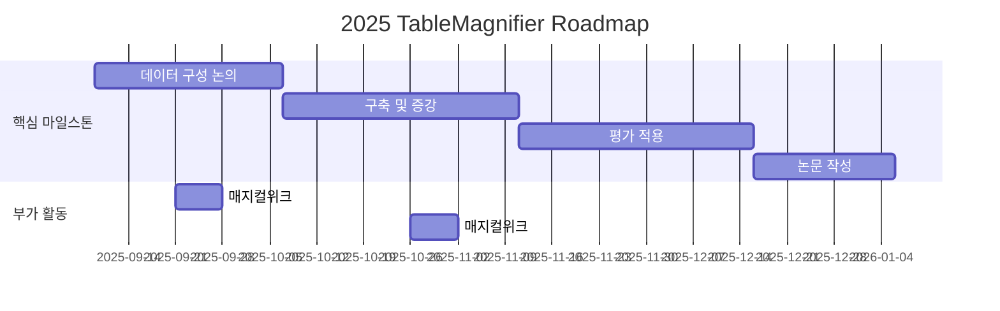
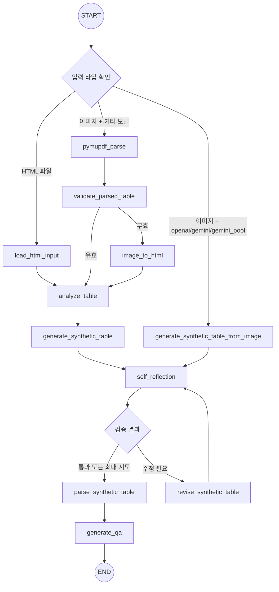

# TableMagnifier

<h1 align="center"> TableMagnifier </h1>

<div align="center">
<a href="https://pseudo-lab.com"></a>
<a href="https://discord.gg/EPurkHVtp2"></a>
<a href="https://github.com/Pseudo-Lab/10th-template/stargazers"></a>
<a href="https://github.com/Pseudo-Lab/10th-template/network/members"></a>
<a href="https://github.com/Pseudo-Lab/10th-template/pulls"></a>
<a href="https://github.com/Pseudo-Lab/10th-template/issues"></a>
<a href="https://github.com/Pseudo-Lab/10th-template/graphs/contributors"></a>
<a href="https://hits.seeyoufarm.com"></a>
</div>
<br>

<!-- sheilds: https://shields.io/ -->
<!-- hits badge: https://hits.seeyoufarm.com/ -->

> TableMagnifier Repository에 오신 것을 환영합니다! 한국어 TableQA에 대한 신뢰도 높은 데이터를 구축하고 평가하는 것을 목표로 합니다.

🚀 {{TableMagnifier}} — 가짜연구소 11기 NLx Crew 소속 프로젝트

“함께 만드는 우연한 혁명(Serendipity Revolution)”
진실함과 신뢰를 바탕으로 AI/DS 혁신 커뮤니티와 기술 실험을 진행합니다.

## 🌟 프로젝트 목표 (Project Vision)
_"이론에서 실전까지, 함께 성장하는 AI 실험실"_  
- 개인 성장과 집단 지혜의 시너지 창출
- 오픈소스 정신을 바탕으로 한 지식 공유 문화
- 실패를 성공의 디딤돌로 만드는 실험적 접근
- 논문 리뷰 프로젝트 — 최신 AI 논문 분석, 토론, 실험 재현
- 오픈소스 프로젝트 — AI·데이터 처리 관련 라이브러리 개발 및 개선
- 컨퍼런스 논문 투고 — 최신 연구 수행 및 국제 학회 제출 준비


## 🧑 팀 소개 (Dynamic Team)

| 역할          | 이름 |  기술 스택 배지                                                                 | 주요 관심 분야                          |
|---------------|------|-----------------------------------------------------------------------|----------------------------------------|
| **Project Manager** | 박세연 |   | VLM, Image Captioning, SLT           |
| **Member** | 최재혁 |   | LLM, RAG, Agent                  |
| **Member** | 이명진 |   | LLM, SLT                  |
| **Member** | 김진아 |   | NLP, Data Science                  |
| **Member** | 서석현 |   | VLM, Data Statistics               |
| **Member** | 임예원 |   | Compiler, Ontology                 |


## 🚀 프로젝트 로드맵 (Project Roadmap)

```mermaid
gantt
    title 2025 TableMagnifier Roadmap
    section 핵심 마일스톤
    데이터 구성 논의       :a1, 2025-09-09, 28d
    구축 및 증강        :a2, after a1, 35d
    평가 적용    :a3, after a2, 35d
    논문 작성    :a4, after a3, 21d
    section 부가 활동
    매지컬위크         :2025-09-21, 7d
    매지컬위크         :2025-10-26, 7d
```


## 💻 주차별 활동 (Activity History)

| 주차 | 날짜 | 활동 | 결과물 유형 | 비고 |
| --- | --- | --- | --- | --- |
| 1 | 9/9 | Introduction |  | 온라인 |
| 2 | 9/16 | 논문 리뷰 (배정 1권, 개별 1권) | 논문 리뷰 문서 | 온라인 |
|  | 9/23 | Magical Week |  | 오프라인 |
| 3 | 9/30 | 논문 리뷰 (배정 1권, 개별 1권) | 논문 리뷰 문서 | 온라인 |
| 4 | 10/14 | Dataset 구성 논의 |  | 온라인 |
| 5 | 10/21 | Raw-data Collection |  | 온라인 |
|  | 10/28 | Magical Week |  | 오프라인 |
| 6 | 11/4 | Data refinement / Augmentation |  | 온라인 |
| 7 | 11/11 | Data refinement / Augmentation | 최종 데이터셋 | 온라인 |
| 8 | 11/18 | Paper Remind / Evaluation Idea Discussion |  | 오프라인 |
| 9 | 11/25 | Pipleine setting |  | 온라인 |
| 10 | 12/2 | Evaluation (Basic) | 아이디어 구현, 결과물 | 온라인 |
| 11 | 12/9 | Evaluation (Advanced) | 아이디어 구현, 결과물 | 온라인 |
| 12 | 12/16 | Evaluation (Advanced) | 아이디어 구현, 결과물 | 온라인 |
| 13 | 12/23 | Evaluation (Advanced) | 아이디어 구현, 결과물 | 온라인 |
| 14 | 12/30 | Github 관리, Paper Writing |  | 온라인 |
| 15 | 1/6 | Github 관리, Paper Writing |  | 온라인 |
| 16 | 1/13 | 회고 및 아카이빙, 투고 준비 | Paper | 오프라인 |


## 🌱 참여 안내 (How to Engage)
- 빌더로 참여 — 프로젝트 기획·운영 주도
- 러너로 참여 — 연구·개발·테스트 등 실행
- 청강 참여 — 공개 세션 참여 가능

❗️참여 링크: [가짜연구소 디스코드](https://discord.gg/EPurkHVtp2)
❗️커뮤니케이션 채널: 카카오톡

**누구나 청강을 통해 모임을 참여하실 수 있습니다.**  
1. 특별한 신청 없이 정기 모임 시간에 맞추어 디스코드 #Room-CS 채널로 입장
2. Magical Week 중 행사에 참가
{{ ... }}

## Acknowledgement 🙏

이 프로젝트는 가짜연구소 Open Academy로 진행됩니다.
여러분의 참여와 기여가 '우연한 혁명(Serendipity Revolution)'을 가능하게 합니다. 모두에게 깊은 감사를 전합니다.

---

# TableMagnifier (테이블 매그니파이어)

TableMagnifier는 한국어 테이블 이미지를 분석하여 구조화된 합성 데이터를 생성하고, 이를 검증 및 수정할 수 있는 도구입니다. LangGraph를 기반으로 한 멀티 에이전트 워크플로우를 통해 이미지에서 HTML 테이블 구조를 추출하고, 이를 바탕으로 새로운 합성 데이터를 생성합니다.

## 주요 기능

- **이미지 to HTML 변환**: 테이블 이미지를 HTML 구조로 변환합니다.
- **합성 데이터 생성**: 원본 테이블의 구조를 유지하면서 새로운 합성 데이터를 생성합니다.
- **자가 검증 및 수정 (Self-Reflection)**: 생성된 합성 데이터가 원본 구조와 일치하는지 검증하고, 필요시 자동으로 수정합니다.
- **QA 데이터 생성**: 생성된 합성 데이터를 바탕으로 RAG 학습용 QA 쌍을 생성합니다.
- **API 키 풀링**: 여러 Gemini API 키를 자동 로테이션하여 무료 할당량을 효율적으로 사용합니다.
- **웹 기반 검증 도구**: 생성된 데이터를 웹 인터페이스에서 시각적으로 확인하고 직접 수정할 수 있습니다.

## 프로젝트 구조

```
TableMagnifier/
├── generate_synthetic_table/   # 핵심 로직 (LangGraph 워크플로우)
│   ├── flow.py                 # 그래프 정의 및 노드 구현
│   ├── runner.py               # 실행 유틸리티
│   ├── cli.py                  # CLI 진입점
│   ├── llm_factory.py          # LLM 팩토리 (OpenAI, Gemini, Gemini Pool, vLLM)
│   ├── validators.py           # 데이터 검증 로직
│   ├── html_to_image.py        # HTML → 이미지 변환
│   └── prompts/                # LLM 프롬프트 템플릿
│
├── polling_gemini/             # Gemini API 키 풀링 시스템
│   ├── api_pool.py             # API 키 로테이션 매니저
│   ├── langgraph_integration.py # LangChain/LangGraph 호환 래퍼
│   └── README.md               # 사용 가이드
│
├── annotate_tools/             # 웹 기반 검증 도구
│   ├── server.py               # FastAPI 백엔드
│   ├── App.tsx                 # React 프론트엔드
│   └── components/             # UI 컴포넌트
│
├── apis/                       # API 키 설정
│   └── gemini_keys.yaml        # Gemini API 키 목록 (gemini_pool용)
│
├── tests/                      # 테스트 코드
├── main.py                     # CLI 진입점
├── pyproject.toml              # 프로젝트 의존성
└── README.md                   # 설명서
```

## LangGraph 워크플로우


```mermaid
flowchart TD
    START((START)) --> RouteStart{입력 타입 확인}
    
    RouteStart -->|HTML 파일| LoadHTML[load_html_input]
    RouteStart -->|이미지 + openai/gemini/gemini_pool| DirectGen[generate_synthetic_table_from_image]
    RouteStart -->|이미지 + 기타 모델| PyMuPDF[pymupdf_parse]
    
    LoadHTML --> Analyze[analyze_table]
    
    PyMuPDF --> Validate[validate_parsed_table]
    Validate -->|유효| Analyze
    Validate -->|무효| ImageToHTML[image_to_html]
    ImageToHTML --> Analyze
    
    Analyze --> GenSynthetic[generate_synthetic_table]
    GenSynthetic --> SelfReflection[self_reflection]
    
    DirectGen --> SelfReflection
    
    SelfReflection --> RouteReflection{검증 결과}
    RouteReflection -->|통과 또는 최대 시도| Parse[parse_synthetic_table]
    RouteReflection -->|수정 필요| Revise[revise_synthetic_table]
    
    Revise --> SelfReflection
    
    Parse --> GenerateQA[generate_qa]
    GenerateQA --> END((END))
```

## 설치 방법

### 사전 요구 사항
- Python 3.10 이상
- Node.js (검증 도구 실행 시 필요)
- OpenAI API Key 또는 Google Gemini API Key

### 1. 프로젝트 클론 및 의존성 설치

```bash
git clone https://github.com/Pseudo-Lab/TableMagnifier.git
cd TableMagnifier

# uv 사용 (권장)
uv sync

# 또는 pip 사용
python3 -m venv .venv
source .venv/bin/activate
pip install -e .
```

### 2. 환경 변수 설정

`.env` 파일을 생성하고 API 키를 입력하세요.

```bash
OPENAI_API_KEY=sk-...
# 또는
GOOGLE_API_KEY=AIza...
```

### 3. Gemini API 키 풀링 설정 (선택사항)

여러 개의 Gemini API 키를 사용하여 무료 할당량을 효율적으로 활용하려면 `apis/gemini_keys.yaml` 파일을 생성하세요:

```yaml
api_keys:
  - name: key1
    key: AIza...your-first-key
    enabled: true
  - name: key2
    key: AIza...your-second-key
    enabled: true
  # 더 많은 키 추가 가능

settings:
  model: gemini-2.5-flash
  temperature: 0.2
  max_retries: 3
  retry_delay: 2
```

## 사용 방법

#### UI 사용방법
```bash
### backend
cd pipeline_ui/backend && uv run python main.py

### frontend
cd pipeline_ui/frontend && npm run dev
```


### 1. 합성 데이터 생성 (CLI)

이미지 파일 또는 HTML 파일을 입력으로 받아 합성 데이터를 생성합니다.

```bash
# OpenAI 사용 (기본)
uv run python -m generate_synthetic_table.cli path/to/table_image.png --save-json output.json

# Gemini 모델 사용 (단일 API 키)
uv run python -m generate_synthetic_table.cli path/to/table_image.png \
  --provider gemini --model gemini-1.5-flash --save-json output.json

# Gemini Pool 사용 (다중 API 키 자동 로테이션) ⭐ 권장
uv run python -m generate_synthetic_table.cli path/to/table_image.png \
  --provider gemini_pool --save-json output.json

# 커스텀 설정 파일 사용
uv run python -m generate_synthetic_table.cli path/to/table_image.png \
  --provider gemini_pool --config-path /path/to/gemini_keys.yaml
```

**옵션 설명:**
| 옵션 | 설명 | 기본값 |
|------|------|--------|
| `image` | 입력 이미지, HTML 파일, 또는 폴더 경로 | (필수) |
| `--provider` | LLM 제공자 (`openai`, `gemini`, `gemini_pool`, `claude`, `vllm`) | `openai` |
| `--model` | 사용할 모델명 | `gpt-4o-mini` |
| `--temperature` | 생성 다양성 조절 | `0.2` |
| `--config-path` | gemini_pool용 설정 파일 경로 | `apis/gemini_keys.yaml` |
| `--base-url` | vLLM 또는 OpenAI 호환 엔드포인트 URL | (선택) |
| `--save-json` | 결과 JSON 저장 경로 | (선택) |
| `--domain` | 프롬프트 도메인 (`medical`, `public`, `insurance`, `finance`, `academic`, `business`) | 자동 감지 |
| `--qa-only` | 합성 데이터 생성 없이 이미지에서 직접 QA만 생성 | `false` |
| `--output-dir` | 배치 처리 결과 저장 디렉토리 | `./qa_output` |
| `--max-workers` | 배치 처리 시 병렬 워커 수 | `3` |
| `--sampling` | 테이블당 랜덤 이미지 샘플링 활성화 | `false` |
| `--min-k` | 테이블당 최소 샘플링 이미지 수 | `2` |
| `--max-k` | 테이블당 최대 샘플링 이미지 수 | `3` |
| `--num-samples` | 테이블당 생성할 랜덤 배치 수 | `1` |
| `--pair-mode` | Public 데이터용 순차 페어 처리 (0-1, 2-3...) | `false` |

### 도메인별 프롬프트

`--domain` 옵션을 사용하여 특정 도메인에 맞는 프롬프트를 적용할 수 있습니다. 각 도메인별 프롬프트는 `generate_synthetic_table/prompts/` 폴더에 정의되어 있습니다.

| 도메인 | 설명 | 자동 감지 조건 |
|--------|------|----------------|
| `medical` | 의료 데이터 (환자 바이탈, 진단명, 약물 용량, 검사 수치 등) | ✅ 파일/폴더명이 `M_`로 시작 |
| `public` | 공공 데이터 | ✅ 파일/폴더명이 `P_`로 시작 |
| `insurance` | 보험 데이터 | ✅ 파일/폴더명이 `I_`로 시작 |
| `finance` | 금융 데이터 | ✅ 파일/폴더명이 `F_`로 시작 |
| `academic` | 학술 데이터 | ✅ 파일/폴더명이 `A_`로 시작 |
| `business` | 비즈니스 데이터 | ✅ 파일/폴더명이 `B_`로 시작 |

**도메인 사용 예시:**
```bash
# Medical 도메인으로 합성 데이터 생성
uv run python -m generate_synthetic_table.cli path/to/medical_table.png \
  --domain medical --provider gemini_pool --save-json output.json

# 폴더 배치 처리 (Medical 도메인)
uv run python -m generate_synthetic_table.cli ./Medical/Table/ \
  --domain medical --max-workers 5 --output-dir ./output

# QA만 생성 (합성 데이터 생성 단계 스킵)
uv run python -m generate_synthetic_table.cli path/to/table.png \
  --domain medical --qa-only --save-json output.json
```

### 실행 예시 및 결과

```bash
$ uv run python -m generate_synthetic_table.cli ./image.png --provider gemini_pool

# 출력 로그
2025-12-15 10:47:42 - polling_gemini.api_pool - INFO - 총 6개의 API 키를 로드했습니다.
2025-12-15 10:47:42 - polling_gemini.api_pool - INFO - API 키 'key1' 사용 중 (모델: gemini-2.5-flash)
2025-12-15 10:47:42 - generate_synthetic_table.flow - INFO - Entering node: generate_synthetic_table_from_image
2025-12-15 10:47:53 - generate_synthetic_table.flow - INFO - Entering node: self_reflection
2025-12-15 10:48:14 - generate_synthetic_table.flow - INFO - Entering node: revise_synthetic_table
2025-12-15 10:48:27 - generate_synthetic_table.flow - INFO - Entering node: self_reflection
2025-12-15 10:48:33 - generate_synthetic_table.flow - INFO - Entering node: parse_synthetic_table
2025-12-15 10:48:38 - generate_synthetic_table.flow - INFO - Entering node: generate_qa

# 결과 JSON
{
  "image_path": "./image.png",
  "synthetic_json": [
    {"경과기간": "1년", "납입보험료 누계": 600000, "해지환급금": 0, "환급률": 0},
    {"경과기간": "3년", "납입보험료 누계": 1800000, "해지환급금": 540000, "환급률": 30},
    {"경과기간": "5년", "납입보험료 누계": 3000000, "해지환급금": 1650000, "환급률": 55},
    ...
  ]
}
```

### 2. 검증 도구 실행 (Web UI)

생성된 `output.json`을 웹 인터페이스에서 확인하고 수정할 수 있습니다.

**서버 실행:**
```bash
python annotate_tools/server.py --file output.json
```

**클라이언트 실행 (별도 터미널):**
```bash
cd annotate_tools
npm install
npm run dev
```
브라우저에서 `http://localhost:5173`으로 접속하여 데이터를 확인하세요.

## polling_gemini 모듈

`polling_gemini`는 여러 Gemini API 키를 자동으로 로테이션하는 풀링 시스템입니다. 무료 할당량이 소진되면 자동으로 다음 키로 전환됩니다.

### 독립 사용 예시

```python
from polling_gemini import create_gemini_chat_model, invoke_gemini

# LangChain 호환 모델로 사용
model = create_gemini_chat_model()
response = model.invoke([HumanMessage(content="안녕하세요!")])

# 간단한 함수 호출
response = invoke_gemini("테이블 데이터를 분석해주세요.")
```

### LangGraph에서 사용

```python
from polling_gemini import create_gemini_chat_model
from langgraph.graph import StateGraph

model = create_gemini_chat_model()

def my_node(state):
    response = model.invoke([HumanMessage(content=state["query"])])
    return {"response": response.content}

graph = StateGraph(...)
graph.add_node("process", my_node)
```

## 🗄️ Google Drive & MongoDB 통합 (Data Handling)

`db/data_handling.py` 모듈을 사용하여 Google Drive에 저장된 데이터를 자동으로 탐색하고 MongoDB에 메타데이터를 저장할 수 있습니다.

### 1. 사전 설정
1.  **Google Drive API 활성화**: [Google Cloud Console](https://console.cloud.google.com/)에서 프로젝트를 생성하고 Drive API를 활성화하세요.
2.  **OAuth 클라이언트 ID**: '데스크톱 앱' 유형의 OAuth 클라이언트 ID를 생성하고 `client.json` 파일을 다운로드하세요.
3.  **파일 배치**: 다운로드한 `client.json` 파일을 프로젝트 내 `info/` 폴더 또는 지정된 경로에 배치하세요.

### 2. 주요 기능 및 사용법
- **자동 드라이브 탐색**: 지정된 `START_FOLDER_ID`를 기준으로 도메인별 폴더를 탐색합니다.
- **메타데이터 저장**: 탐색된 파일의 ID, 이름, 도메인 정보를 MongoDB의 `TableInformation` 데이터베이스에 저장합니다.
- **이미지 다운로드**: `download_file_bytes()`를 사용하여 특정 이미지를 바이트 형태로 가져올 수 있습니다.

### 3. 실행 방법
`db/data_handling.py` 파일 내의 설정을 확인하거나, 다음과 같은 환경 변수를 사용하여 설정을 관리할 수 있습니다.

*   `GOOGLE_DRIVE_CLIENT_JSON`: `client.json` 파일의 경로 (기본값: `info/client.json`)
*   `GOOGLE_DRIVE_START_FOLDER_ID`: 탐색을 시작할 Google Drive 폴더 ID

```bash
# 환경 변수 설정 예시 (PowerShell)
$env:GOOGLE_DRIVE_START_FOLDER_ID="your_folder_id_here"
uv run python db/data_handling.py
```

> [!IMPORTANT]
> 실행 전 반드시 `client.json` 파일을 `info/` 폴더에 배치하고, 대상 폴더 ID를 확인하세요.

---


<h2>Contributors 😃</h2>
<a href="https://github.com/Pseudo-Lab/TableMagnifier/graphs/contributors">
  
</a>

<h2>License 🗞</h2>

This project is licensed under the [MIT License](https://opensource.org/licenses/MIT).


