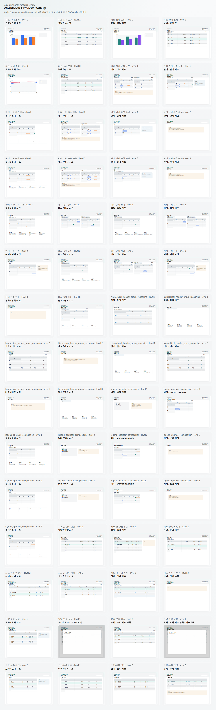
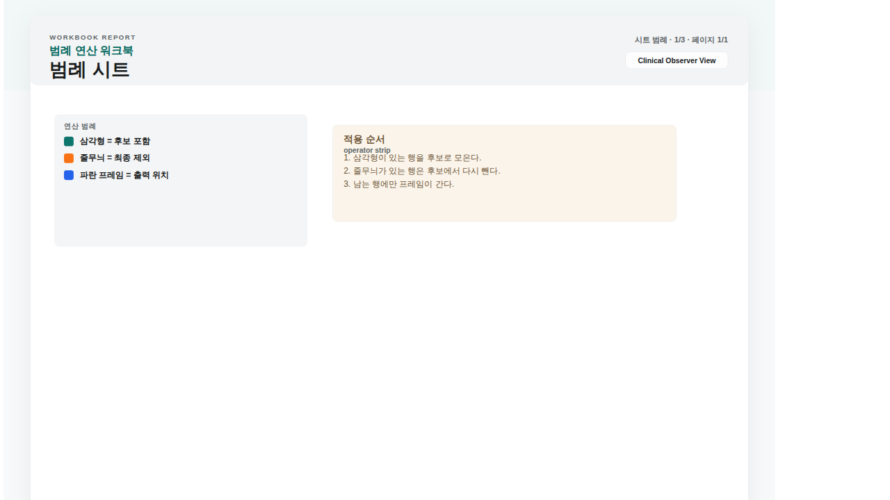

# Example Gallery

이번 문서의 이미지는 Playwright로 캡처한 PNG다. 원본 SVG와 gallery index는 `raw_previews/`에 함께 들어 있다.

## 전체 preview gallery

현재 저장소에서 렌더링 가능한 family/page surface를 한눈에 보는 용도다.

## `channel_policy_transfer` Level 3 query

- 예시에서 유도한 규칙을 query 표에 전이해야 한다
- Level 3에서는 appendix/note 해석까지 엮일 수 있다

## `inventory_exception_disambiguation` Level 3 counterexample

- 예시만 보면 여러 규칙이 살아남는다
- counterexample이 잘못된 가설을 제거한다

## `report_scope_reconciliation` Level 3 overview

- merged header, 들여쓰기, subtotal block이 함께 범위를 만든다
- text만 읽으면 구조를 놓치기 쉬운 family다

## `legend_operator_composition` Level 3 legend

- legend와 operator order를 읽어야 query를 해석할 수 있다
- 포함/제외 순서가 바뀌면 답이 달라진다

